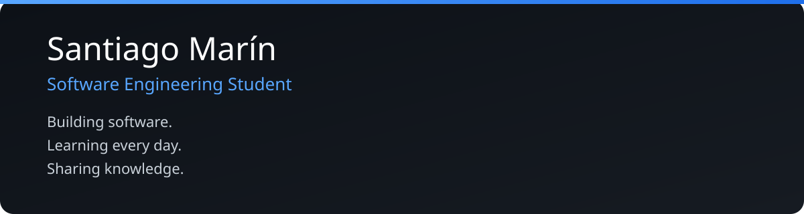

  

<table width="100%">
<tr>

<td width="70%" valign="top">

<h2>👨‍💻 Sobre mí</h2>

Soy <strong>Santiago Marín</strong>, estudiante de <strong>Ingeniería en Software</strong>.

Me apasiona crear software, aprender constantemente y compartir cada proyecto que desarrollo.

Mi objetivo es colaborar con desarrolladores de todo el mundo y construir proyectos útiles para la comunidad.

</td>

<td width="30%" align="center">

</td>

</tr>
</table>

 

 

